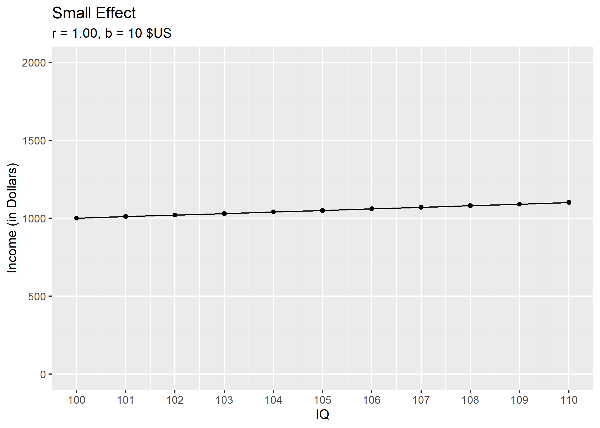

```{r setup, include = F}
library(ggplot2); library(magrittr)
```

# Small Effect

```{r}
# create data-frame
iq <- seq(100, 110, 1)
income <- seq(1000, 1100, 10)
(d_1 <- data.frame(iq, income))

# calculate correlation
(cor_1 <- cor(d_1$iq, d_1$income))

# calculate regression coefficient
reg_1 <- lm(income ~ iq, d_1)
summary(reg_1)

# visualization
vis_1 <- ggplot(d_1, aes(iq, income)) +
  geom_point() +
  geom_line() +
  scale_x_continuous(breaks = scales::pretty_breaks(n = 10)) +
  scale_y_continuous(limits = c(0, 2000)) +
  labs(y = "Income (in Dollars)",
       x = "IQ",
       title = "Small Effect",
       subtitle = paste0("r = ", td::my_round(cor_1, "std"), ", b = ", round(reg_1$coefficients["iq"], 0), " $US"))
print(vis_1)
ggsave("figure_01.png", dpi = 220, width = 7, height = 5)
```

# Large Effect

```{r}
# create dataframe
income <- seq(1000, 2000, 100)
(d_2 <- data.frame(iq, income))

# calculate correlation
cor_2 <- cor(d_2$iq, d_2$income)
print(cor_2)

# calculate regression coefficient
reg_2 <- lm(income ~ iq, d_2)
summary(reg_2)

# visualization
vis_2 <- ggplot(d_2, aes(iq, income)) +
  geom_point() +
  geom_line() +
  scale_x_continuous(breaks = scales::pretty_breaks(n = 10)) +
  scale_y_continuous(limits = c(0, 2000)) +
  labs(y = "Income (in Dollars)",
       x = "IQ",
       title = "Large Effect",
       subtitle = paste0("r = ", td::my_round(cor_2, "std"), ", b = ", round(reg_2$coefficients["iq"], 0), " $US"))
print(vis_2)
ggsave("figure_02.png", dpi = 220, width = 7, height = 5)
```

# Create GIF

```{r}
system2("magick", 
        c("convert", "-delay 200", "figure_*.png", "visualization_correlations.gif"))

```
